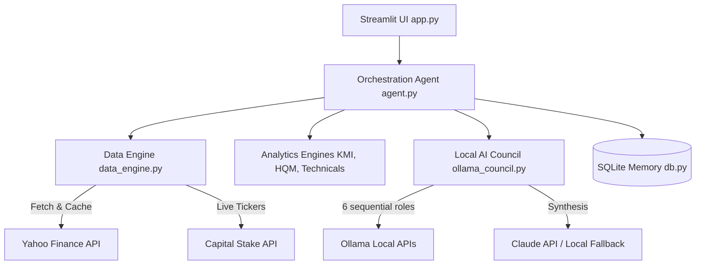

# PSX Advisory Agent v3 — System Architecture & Developer Guide

Welcome to the Developer Guide for the **PSX Advisory Agent v3**. This documentation is designed to assist engineers, systems integrators, and developers in deploying, maintaining, and extending this codebase for institutional or private use.

---

## 🏛️ System Architecture Overview

The system consists of five primary layers:
1. **Frontend Presentation (Streamlit)**: Responsive UI divided into tabs for dashboards, portfolio management, AI boardroom debates, backtesting, and accuracy analysis.
2. **Orchestration Agent**: Orchestrates daily runs, compiles statistics, matches predictions to historical closing prices, and logs system events.
3. **Quantitative & Rules Engines**: Pure Python calculation engines for technical indicators, shariah compliance screens, and high-quality momentum (HQM) universe scoring.
4. **Multi-Agent Board Room (LLM)**: Debates tickers using up to 6 local Ollama roles (Bull, Bear, Shariah, Quant, Macro, Risk) plus an LLM Chairman synthesis (Claude/local fallback).
5. **Persistence Layer (SQLite)**: WAL-journaled SQLite storage for transactions, board verdicts, daily snapshot performance logs, and self-learning feedback loops.



---

## 📁 Repository Directory Structure

- [app.py](file:///d:/psx_agent_v3/psx_v3/app.py): Streamlit entrypoint, styling sheets, state management, and tab routing.
- [agent.py](file:///d:/psx_agent_v3/psx_v3/agent.py): Core orchestrator for daily analysis, accuracy evaluation, and alert creation.
- **[core/](file:///d:/psx_agent_v3/psx_v3/core)**:
  - [data_engine.py](file:///d:/psx_agent_v3/psx_v3/core/data_engine.py): Live ticker fetching, timezone-aware PKT market open/closed status, and Parquet caching.
  - [hqm_engine.py](file:///d:/psx_agent_v3/psx_v3/core/hqm_engine.py): Quantitative Momentum percentile scorer based on Gray-Vogel methodology.
  - [shariah_engine.py](file:///d:/psx_agent_v3/psx_v3/core/shariah_engine.py): Meezan-standard 5 KMI compliance tests and dividend purification calculator.
  - [indicators.py](file:///d:/psx_agent_v3/psx_v3/core/indicators.py): Tech indicators (RSI, Bollinger bands, MACD, EMA trends) and Trailing Stop-Loss checking.
  - [macro_sentiment.py](file:///d:/psx_agent_v3/psx_v3/core/macro_sentiment.py): Public market feed RSS scraping and yfinance news ingestion using `feedparser`.
  - [kmi_data.py](file:///d:/psx_agent_v3/psx_v3/core/kmi_data.py): Default watchlist, KMI All Share constituents, and trading hours specifications.
- **[council/](file:///d:/psx_agent_v3/psx_v3/council)**:
  - [ollama_council.py](file:///d:/psx_agent_v3/psx_v3/council/ollama_council.py): Multi-agent chat router, JSON parsing logic, 8GB VRAM protectors, and system prompts.
- **[memory/](file:///d:/psx_agent_v3/psx_v3/memory)**:
  - [db.py](file:///d:/psx_agent_v3/psx_v3/memory/db.py): DB schema definition, helper queries, and WAL-mode connection pools.
- **[ui/](file:///d:/psx_agent_v3/psx_v3/ui)**:
  - [dashboard_tab.py](file:///d:/psx_agent_v3/psx_v3/ui/dashboard_tab.py): Renders portfolio indicators, candlestick charts, and market/macro banners.
  - [predictions_tab.py](file:///d:/psx_agent_v3/psx_v3/ui/predictions_tab.py): Displays ranking matrixes and Shariah screens.
  - [council_tab.py](file:///d:/psx_agent_v3/psx_v3/ui/council_tab.py): Unified board matrix table, single stock detailed views, and batch convene buttons.
  - [weekly_review_tab.py](file:///d:/psx_agent_v3/psx_v3/ui/weekly_review_tab.py): Main ledger interface showing buys/sells and realized P&L.
  - [learning_tab.py](file:///d:/psx_agent_v3/psx_v3/ui/learning_tab.py): Visual feedback log displaying hit/miss rates and self-criticisms.

---

## 💾 Database Schema Spec

All data is stored inside a local SQLite file: `data/psx_memory.db`. Write-Ahead Logging (`WAL`) is enabled to allow concurrent reads during sequential writes.

### 1. `investments`
Tracks active and historical user stock holdings.
```sql
CREATE TABLE investments (
    id              INTEGER PRIMARY KEY AUTOINCREMENT,
    symbol          TEXT    NOT NULL,
    company_name    TEXT,
    pkr_invested    REAL    NOT NULL,
    shares          INTEGER NOT NULL,
    entry_price     REAL    NOT NULL,
    entry_date      TEXT    NOT NULL,
    exit_price      REAL,
    exit_date       TEXT,
    status          TEXT    DEFAULT 'OPEN',   -- OPEN / CLOSED
    notes           TEXT,
    created_at      TEXT    DEFAULT (datetime('now'))
);
```

### 2. `council_decisions`
Stores multi-agent board room verdicts.
```sql
CREATE TABLE council_decisions (
    id              INTEGER PRIMARY KEY AUTOINCREMENT,
    symbol          TEXT    NOT NULL,
    decision_date   TEXT    NOT NULL,
    final_verdict   TEXT    NOT NULL,         -- BUY / HOLD / SELL
    final_score     REAL,
    consensus       TEXT,
    confidence      TEXT,
    bull_verdict    TEXT,
    bear_verdict    TEXT,
    shariah_verdict TEXT,
    quant_verdict   TEXT,
    local_verdicts  TEXT,                     -- JSON block of all models
    chairman_notes  TEXT,                     -- Chairman synthesis narrative
    price_at_decision REAL,
    macro_sentiment TEXT,
    acted_on        INTEGER DEFAULT 0,        -- 1 if user buys stock
    created_at      TEXT    DEFAULT (datetime('now'))
);
```

### 3. `decision_reflections`
Feeds the self-learning reflection loop.
```sql
CREATE TABLE decision_reflections (
    id              INTEGER PRIMARY KEY AUTOINCREMENT,
    decision_id     INTEGER NOT NULL,
    symbol          TEXT    NOT NULL,
    decision_date   TEXT    NOT NULL,
    verdict         TEXT    NOT NULL,
    price_at_decision REAL  NOT NULL,
    price_now       REAL    NOT NULL,
    price_change_pct REAL   NOT NULL,
    is_correct      INTEGER NOT NULL,         -- 1 (Hit) / 0 (Miss)
    reflection_notes TEXT   NOT NULL,         -- Self-critical assessment
    created_at      TEXT    DEFAULT (datetime('now'))
);
```

---

## 🧠 Core Calculations & Algorithms

### 1. High-Quality Momentum Scoring (HQM)
Defined in [hqm_engine.py](file:///d:/psx_agent_v3/psx_v3/core/hqm_engine.py), it ranks the relative momentum of each stock against the trading universe based on:
- 1-Month Return
- 3-Month Return
- 6-Month Return
- 12-Month Return

The engine computes percentile scores for each stock across all four timeframes. The final HQM score is the average of these four percentiles, rewarding stocks showing consistent momentum rather than sudden spikes.

### 2. Shariah Compliance Screens
Defined in [shariah_engine.py](file:///d:/psx_agent_v3/psx_v3/core/shariah_engine.py), checking stocks against Meezan Bank/KMI Index criteria:
1. **Halal Activity**: Core business sector cannot match conventional banking, insurance, alcohol, tobacco, gambling, or interest finance.
2. **Interest Debt Ratio**: $\frac{\text{Interest-bearing Debt}}{\text{Total Assets}} < 33\%$.
3. **Non-Halal Income**: $\frac{\text{Non-Halal Income}}{\text{Total Revenue}} < 5\%$.
4. **Illiquidity Ratio**: $\frac{\text{Fixed / Property Assets}}{\text{Total Assets}} > 25\%$ (or strictly $> 50\%$).
5. **Net Liquid Assets Screen**: $\text{Market Cap} > (\text{Total Assets} - \text{Total Equity})$.

---

## 🛡️ VRAM Defense & Multi-Agent Execution

### VRAM Clearing Strategy
To ensure that models run reliably on an **8GB VRAM card** (and avoid system slowdowns when memory overflows into system RAM):
1. **Sequential Execution**: Analysts run one after the other. No parallel LLM calls.
2. **Explicit Unloading**: Every call to the local Ollama API specifies `"keep_alive": 0` in the payload. This instructs Ollama to immediately purge the model weights from the GPU's memory after completing the token response.
3. **Consistent Settings**: `"temperature": 0.2` and `"num_predict": 1200` are enforced on all local roles to prevent rambling, long generation times, or infinite loops.

### Model Roster Optimization
The model roster assigns appropriate tasks depending on model sizes and parameter strengths:
- **Bull (Qwen 2.5 7B)**: Strong positive catalyst parsing.
- **Bear (DeepSeek R1 7B)**: Utilizes thinking chains to locate weaknesses and ignore bullish noise.
- **Shariah (Gemma 3 4B)**: Fast and balanced rule-based evaluation.
- **Quant (Mistral 7B)**: Reliable numbers-to-sentiment parser.
- **Macro (DeepSeek R1 7B)**: Analyzes geopolitical and policy context.
- **Risk (DeepSeek R1 7B)**: Identifies worst-case drawdowns.
- **Chairman (Claude Sonnet 4 / Local DeepSeek R1 7B)**: Synthesizes opinions into structured recommendations.

---

## 🌐 External APIs & Data Feeds

### 1. Yahoo Finance (`yfinance`)
- **Ticks**: PSX symbols require the `.KA` suffix (e.g. `SYS` becomes `SYS.KA`).
- **Caching**: Calculated indicators and OHLCV bars are saved as Parquet cache files under `data/cache/` with a default TTL of 4 hours to minimize API rate limiting.

### 2. Capital Stake API
- **Endpoint**: `GET https://csapis.com/3.0/market/tickers`.
- **Purpose**: Live retrieval of active symbols across the Pakistan Stock Exchange to scale analysis scope to the entire market.
- **Fail-safe**: Gracefully degrades to the local KMI constituent watchlist if the API returns 403 (unauthorized) or is unreachable.

### 3. Public RSS Headlines (`feedparser`)
- Scrapes live market sentiment and macro news from Yahoo Finance indices and PK macro RSS feeds.
- Character-based truncation is applied to RSS texts before ingestion to prevent context windows from expanding.
